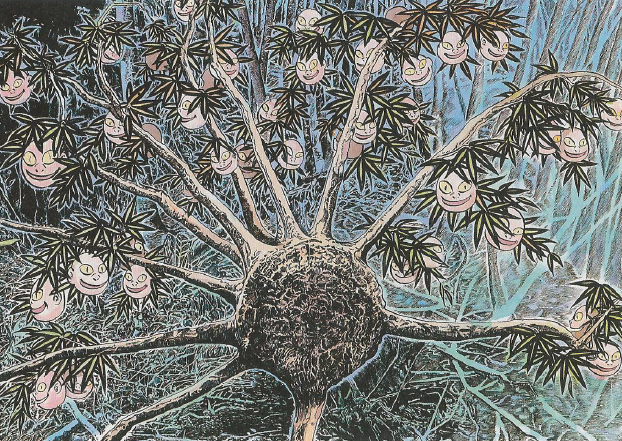

# gorph

gorph is an efficient recursive file watcher that accepts [double-star globs](https://pkg.go.dev/github.com/bmatcuk/doublestar).

In builds on [fsnotify](https://pkg.go.dev/github.com/fsnotify/fsnotify) providing sorely needed recursive functionality while retaining it's excellent cross-platform support and stability.

## Value Proposition

There does not appear to be a good alternative for this. The goal is:

- efficient and flexible globbing
- good cross-platform support
- simple, intuitive API
- usable as a package or a binary



## Why Gorph
The name was chosen haphzaradly to seem like "go recursive file watcher".

## Using it as a binary

Install and use like so:

```sh
$ go install github.com/sean9999/go-fsnotify-recursively/cmd/gorph@latest
$ gorph # watch everything recursively in current directory
$ gorph ~/Videos/**/*.mov # watch Videos recursively for anything with a .mov extension
```

## Using as a package

```go
package main
import (
    gorph "github.com/sean9999/go-fsnotify-recursively"
)

func main(){

    //  watch for any text file under ./testdata/
    //  double-stars mean search recursively
    watcher := gorp.New("testdata/**/*.txt")

    //  two channels
    events, errs := watcher.Listen()

    ...    
    

}
```